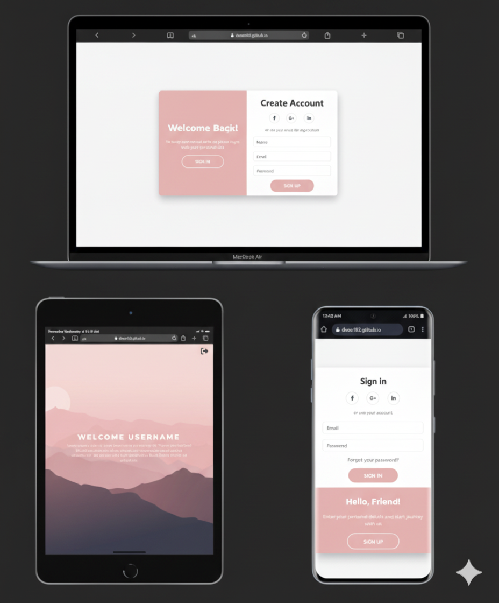

# 👤 Mini Login System

A simple, responsive client-side login and registration web app.

---

## 💡 Key Features and JavaScript Logic:

🔻 User registration and login with persistent data storage in localStorage
🔻 Validation using Regex to check name format, email structure, and password quality before account creation
🔻 Duplicate account prevention to avoid registering with an existing email
🔻 Clear feedback messages to guide the user for errors and success states
🔻 Personalized user experience with a custom welcome message after login
🔻 Sign-out functionality that ends the active session
🔻 Fully responsive UI for a clean and user-friendly layout across all devices

---

## 🛠️ Tech Stack

- **HTML5**  
- **CSS3**  
- **Bootstrap 5**  
- **Responsive Design**
- **JavaScript (DOM manipulation, Event handling, LocalStorage, Regex Validation)**  
- **Google Fonts**  
- **Font Awesome**

---

## 💻 GitHub Repo & Live Demo

🔗 **GitHub Repo:** [Mini Login System](https://github.com/Doaa182/Login-System)
🌐 **Live Demo:** [View on GitHub Pages](https://doaa182.github.io/Login-System/)

---

## 👩‍💻 Author

**Doaa Diaa El Din**  
🔗 [GitHub Profile](https://github.com/Doaa182)

---
## 📸 Screenshots

